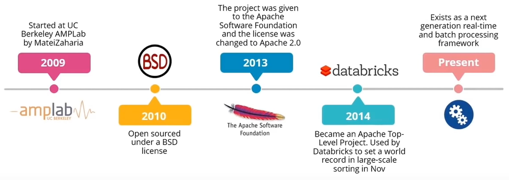
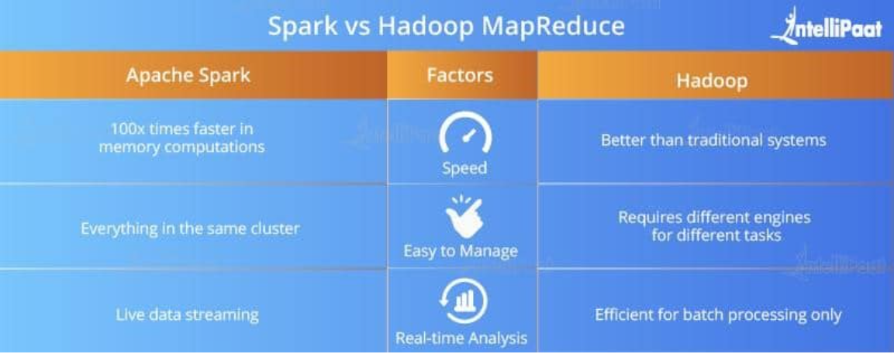
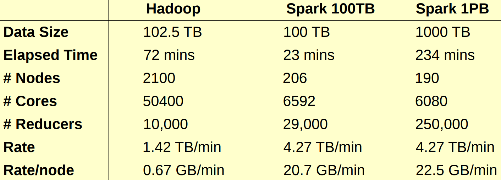
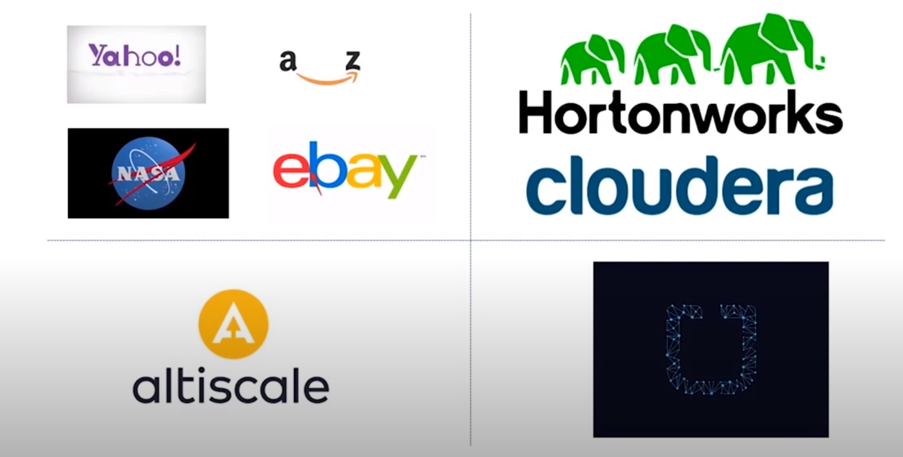
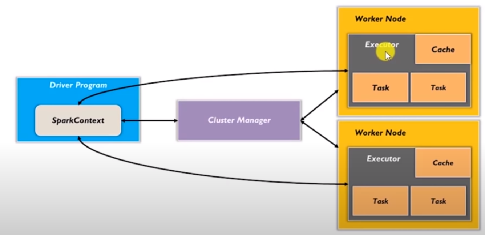
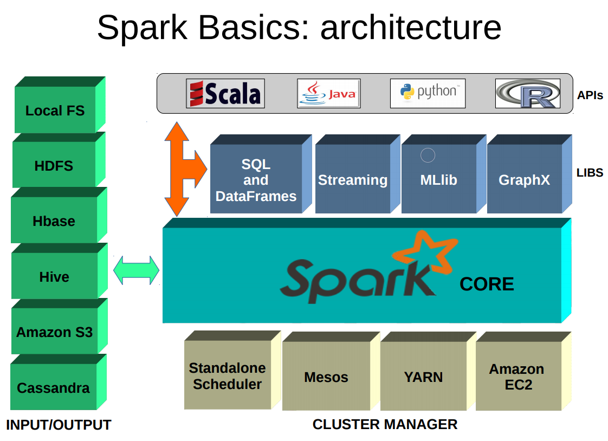
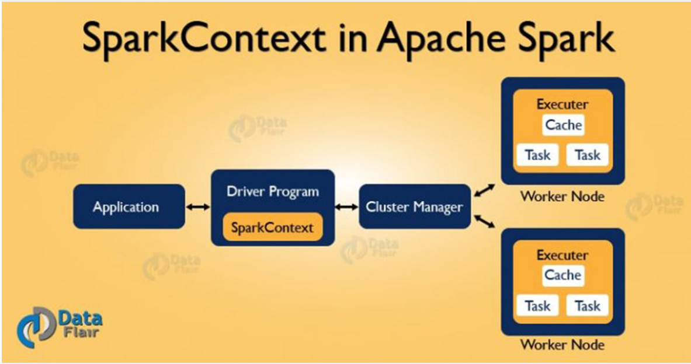

# Big Data Training
1. [ Topic-1. ](#topic1)
2. [ Topic-2. ](#topic2)
3. [ Topic-3. ](#topic3)
4. [ Topic-4. ](#topic4)
5. [ Topic-5. ](#topic5)

<a name="topic1"></a>
## Topic-1: Introduction to Big Data and Apache Spark
### Introduction
Getting to know each other
### About the training session
* Motivation: the era of big data, sources of big data,
 statistics, applications and use cases.
 
    [Introduction to Big Data](tutorials/Introduction-to-big-data.pptx)
    
    For further Applications of Bid Data, have a look at:
    [Big Data Applications](https://www.ubuntupit.com/best-big-data-applications-in-todays-world/)
* Outline: Topics to be covered throughout the course

    2.	The position of Spark in Hadoop echo system, the main component of Apache Spark, and the limitation of using Hadoop in processing big data.
    3.	Scala Programming with practices on Spark applications
    4.	The main differences between RDDs, Dataframes, and Datasets in Spark
    5.	Use cases revealing the important role of Spark SQL in data exploration
    6.	Introduction to NoSQL and practices of data manipulation using MongoDB.
    7.	Indexing and searching big textual content using Elasticsearch with practical exaples.
    8.	Spark ML library with use case scenarios on regression and recommendation systems.
    9.	Spark NLP in text preprocessing and analysis.
    10.	Introduction to Tensorflow and Keras to classify huge textual content and apply that for sentiment analysis.
    11.	Data Stream and Apache Kafka
   
 
### Spark as a part of the Hadoop echo System
<a name="topic1-apache-spark"></a>
* Big Data Tools
    * _Hadoop_: Batch processing of data
    * _Spark_: Both real-time and batch processing
    
* What is Apache Spark?
    * Hadoop sub-project by UC Berkeley's ampLab in 2009
    * Spark is a UNIFIED platform for cluster computing and distributed big data processing, enabling efficient big
      data management and analytics.
    * Spark is designed to be fast and general purpose.
    * data parallelism and fault-tolerance
* Spark History
    Depicted in the figure below
   
* Who Can Benefit from Spark?
    * _Data Scientists_: Spark provides data-focused tools towards
     going beyond problems that fit in a single machine
    * _Engineers_: Spark helps eliminating the need to use many
    different special-purpose platforms for streaming, machine learning, and
    graph analytics.
    * _Students_: The rich API provided by Spark makes it easy to learn
     data analysis and program development in Java, Scala or Python.
    * _Researchers_: New opportunities exist for designing distributed algorithms
    and testing their performance in clusters.
* Spark vs Hadoop (sorting 1PB)
    
    
* Spark Features: 
    * Real-time processing with low latency because of in-memory computation
    * 100x time faster for large-scale processing
    * polyglot: building spark applications using multiple languages
    * Powerful caching
    * multiple deployment mode: e.g., mesos, yarn, spark cluster manager 
* Industry using Apache Spark:
    
    


### Spark APIs, Architecture, and Components:
<a name="topic1-spark-arch-components"></a>
* Spark Applications are built using a number of programming languages, i.e., Scala, Python, Java, R
* Scala is preferred an long with Spark since:
    * Scala is a statically typed language which allows us to find compile time errors
    * Scala has multiple standard libraries and cores which allows quick integration of the databases in Big Data ecosystems.
    * Scala is frequently over 10 times faster than Python.
    * Single line of code in Scala can sometimes replace 20 to 25 lines of code in Java
    * Excellent built-in concurrency support and libraries
              For more information, see [(Scala vs Python)](https://www.kdnuggets.com/2018/05/apache-spark-python-scala.html)
* Spark Architecture:
    * Spark uses a master-worker architecture
    * Master node: a driver program that drives your application (The code you are writing) or the shell if you are using an interactive shell.
        * a node where a spark-context is created. 
        * A spark-context: a gateway to all Spark functionalities and take care of job execution within cluster.
        * Spark-context communicates with cluster manager that controls the resources in spark cluster and allocate suitable resources to the tasks composing a certain 
        job.
        * Examples of cluster manager: Spark Standalone Cluster, Apache Mesos, Hadoop Yarn, and Kubernetes.
        * task are distributed over the worker nodes.
    * Worker nodes (slave nodes): they execute the tasks and return result to Spark context.
        * Executor: a distributed engine inside each worker, responsible for executing the tasks.
        * To recap: Spark context takes a job and breaks it down into a number of tasks and distributes them to the 
        worker nodes.
        
* Spark Shells:
    * Spark-shell: with Scala Support
    * PySpark with python Support
    * SparkR with R support
 
* Spark RDDS:
    * a distributed collections of items.
    * a read-only (i.e., immutable) collection of items partitioned
    * in-memory data sharing
    * fundamental data structure of apache spark 
    across a set of machines that can be rebuilt if a partition is destroyed.
    * a considerable amount of work done in Spark includes:
        * creating RDDs
        * transforming existing RDDs
        * performing actions on RDDs
    * RDDS creations: 
        - loading an already existing set of objects <br /> ```val localRDD = sc.textFile("localfile.txt")```
        - parallelizing a data collection in the driver <br> ```val listRDD = sc.parallelize(myList)```
        <br/> ```val listRDD = sc.parallelize(List("Java", "Scala", "R"))```
        - transforming a certain RDD into another RDD 
        <br /> ``` val resultRDD = listRDD.filter(x=>x.contains("R")) ```
    * Spark operations:
        1. transformation: creating a new RDD from an existing one, e.g., using `map, filter, groupBy, reduceByKey,
                                                                    partitionBy, sortByKey, join, etc`
            <br />E.g., ```val resultRDD = listRDD.map(x=>(x,1)) ```
            <br />E.g., ```sc.parallelize(List(1,2,3,4,5)).filter(_ %2==0) ``` //filter: returns an RRD containing all elements that meet a passed predicate 

        2. action: applied on the RDD, e.g., using `reduce, collect, take, count, saveAsTextFile, etc`
        
            _computation takes place only on actions and not on transformations!  (Lazy evaluation)_
            
            At any point we can force the execution of
            transformation by applying a simple action such
            as count().
            
            <br />E.g., ```val result = sc.parallelize(1 to 100).reduce(_+_) ``` // sum of all elements
            <br />E.g., ```val result = sc.parallelize(List("Hamed","Abdelhaq")).reduce((x1,x2)=>x1 + " " + x2) ``` // sum of all elements
            
            Exercise: Have a look at `first`, `take` action functions

    
* Spark Components:
    The main functionality is implemented in Spark Core. Other
    components exist, that integrate tightly with Spark Core.
    
    
* Useful libraries in Spark:
    Currently the following libs exist and they are evolving really-really fast:
    * _Spark SQL_: a library for querying structures datasets as well as
                 distributed datasets, allowing relational queries expressed in SQL, 
                 HiveQL, or Scala to be executed using Spark.
    * _Spark Streaming_: a library to ease the development of complex streaming applications.
    Data can be inserted into Spark from different sources like Kafka, and Kinesis.
    * _Spark Machine Learning (MLlib)_: MLlib is Spark's scalable machine learning library.
    * _Spark Graph (GraphX)_:  an API for graph processing and graph-parallel algorithms on-top of
Spark

                            
              
* [More About Apache Spark](https://www.youtube.com/watch?v=QaoJNXW6SQo)


         
 ### Configuring Spark Development Environment
 
 *	Java installed
 *	IntelliJ installed and Scala included
 *	Spark binaries downloaded and configured.
    For more detailed steps, follow the instructions in 
   [Configuring Spark](https://medium.com/@ligz/installing-standalone-spark-on-windows-made-easy-with-powershell-7f7309799bc7)
 
 <a name="topic1-scala-APIs"></a>          
 ### Practice-1: Spark-shell and scala APIs
* Running spark-shell
            cmd
            type "spark-shell"
            
 
   [](https://data-flair.training/blogs/learn-apache-spark-sparkcontext/ )
   
   Spark Context:
   * the entry gate of Apache Spark functionality.  
   * allows your Spark Application to access Spark Cluster with 
   the help of Resource Manager (YARN/Mesos). 
   * To create SparkContext, first SparkConf should be established. 
        * The SparkConf has a configuration parameter that our Spark driver application will pass to SparkContext.
        * SparkContext is generated automatically when spark-shell is loaded. SparkContext will use default 
        configurations to set the parameters of SparkConf.
        
   *  [Kick-off Start with Scala](src/main/scala/org/hamedabdelhaq/spark/demos/basics/SearchInList.scala) 
   
        * Simple commands: creating list variable, parallelize it, and returning a sublist with elements below 10
              
        * Also, we will try out the code directly using spark-shell.
        
* Clarifying the concept of transformation (lazy transformation) and actions with examples
* Basics of Scala programming
    * [Functional Programming – What and Why?](https://bit.ly/2RIKGtN)
    * [Basics of Scala Programming](http://allaboutscala.com/tutorials/chapter-2-learning-basics-scala-programming/)
    * [Higher-order functions in Scala](https://dzone.com/articles/higher-order-functions-in-scala-1)

 ### Practice-2:
 
 * [Hello World Example (Word Count)](src/main/scala/org/hamedabdelhaq/spark/demos/basics/WordCountSpark.scala)
 ### Practice-3:
 * [Handling Retail Dataset using Spark](src/main/scala/org/hamedabdelhaq/spark/demos/retail_db/RevenueRetrieval.scala)

      
      


<a name="topic2"></a>
## Topic-2: Big Data and Information Retrieval
After completing this session, the participants will be able to:
1.	Understand the concept of Information Retrieval and its role in building search engines
2.	Apply APIs from SparkSQL library to answer queries over DataFrames
3.	Differentiate between DataFrames, Datasets and RDDs
4.	Index textual content using ElasticSearch framework
5.	Pose rich queries against ES indexes

## Introduction to Spark SQL
Querying structures datasets as well as distributed datasets, 
allowing relational queries expressed in SQL, HiveQL, or Scala to be executed using Spark.
Spark SQL provides an interface that makes RDDs appear as relational tables. 
Utilizing these sorts of abstractions makes it easy for developers to intermix SQL commands querying external data with complex analytics, 
throughout a single application. In other words, Spark SQL allows developers to:
    
* Import relational data from Parquet files and Hive tables
* Run SQL queries over imported data and existing RDDs
* How to build UDF and call during the manipulation of DataFrames
* Easily  write RDDs out to Hive tables or Parquet files

### Parquet files as Columnar file format 
Parquet stores binary data in a column-wise manner. That is the values in each column are organized so that they are all 
adjacent, enabling better compression and performance. This is essential for queries which read particular columns from tables 
 with many columns since only needed columns are read and IO is reduced. Read this for more details on Parquet.
[Resource 2.1](https://medium.com/@sparkcodegeeks/apache-spark-and-parquet-example-spark-by-examples-5b701a9e606d)

* loading a parquet file into a spark dataframe
```scala
// Read in the parquet file created above
// The result a DataFrame
val df = spark.read.parquet("path_of_parquet_file")
```

* storing a dataframe as a parquet file
```scala
 df.write.parquet("path_of_parquet_file")
```

### Comparison Between RDDs, DataFrame, and Datasets
 [Resource 2.2](https://data-flair.training/blogs/apache-spark-rdd-vs-dataframe-vs-dataset/)
 * brief introduction of Spark APIs i.e. RDD, DataFrame and Dataset
    * RDD is the fundamental data structure of Spark. It allows a programmer to perform in-memory computations on large clusters in a fault-tolerant manner
 * Spark Dataframe APIs: 
    * data organized into named columns
    * similar to tables in a relational database
    * allows developers to impose a structure onto a distributed collection of data
 * Spark Dataset APIs:
    * extension of DataFrame API
    * provides type-safe, object-oriented programming interface


### Data exploration using Spark SQL (Applicatons)
   <!-- Loading wiki data (parquet file) [Resource 2.3](https://bit.ly/2TcAlHL) -->
   
   * _App-1_: In this demo, we read a json file containing a large number of records representing customer information.
        * More comments/description/details can be found as inline comments within the code lines.
        * A number of practices are also embedded within code segments. 
        * The code of this demo can be accessed through: [code](src/main/scala/sparkSQLDemo/SparkDfDemo.scala)
* Information Retrieval (IR)
    * Definition
    * Motivation
    * Applications
    * Technologies and links to big data
    * [Resource-2.4](tutorials/Information Retrieval-1.pptx)
    
* ElasticSearch
    * What is ES
        * Elasticsearch is an Apache Lucene-based search server
        * A real-time distributed and open source full-text search and analytics engine.
        * accessible from RESTful web service interface and uses schema less JSON (JavaScript Object Notation) documents to store data. 
        * It enables users to explore very large amount of data at very high speed.
    * Key features:
        * scalable up to petabytes of structured and unstructured data.
        * can be used as a replacement of document stores like MongoDB
        * currently being used by many big organizations like Wikipedia, StackOverflow, GitHub etc.
        * open source and available under the Apache license.
        
    * Install ES via [ElasticSearch Download](https://www.elastic.co/downloads/elasticsearch).
    * Install PostMan to try some ES Basic operations
        * Creating an index: (school)
        * Inserting a new index:
            * localhost:9200/school/_doc
              ```json
                {
                    "name":"Saint Paul School222", 
                    "description":"ICSE Afiliation222",
                    "street":"Dawarka", 
                    "city":"Delhi", 
                    "state":"Delhi", 
                    "zip":"110075",
                    "location":[28.5733056, 77.0122136], 
                    "fees":5000,
                    "tags":["Good Faculty", "Great Sports"], 
                    "rating":"4.5"
                }
                ```
    
            * Data organization under ES
                * Elasticsearch_manipulation/d2p3-tweet-indexing.ipynb
    * Document indexing
    
    * Query Processing


<a name="topic3"></a>
## Topic-3: Machine Learning using Spark
### Spark ML Library
   * Introduction to Spark MLlib
   
       MLlib is Spark’s machine learning (ML) library that makes the implementation of different machine learning algorithms
        scalable and easy. 
       The main features of MLlib can be summarized as follows:
       
       * _ML Algorithms_: common learning algorithms such as classification, regression, clustering, and collaborative filtering
       * _Featurization_: feature extraction, transformation, dimensionality reduction, and selection
       * _Pipelines_: tools for constructing, evaluating, and tuning ML Pipelines
       * _Persistence_: saving and load algorithms, models, and Pipelines
      
       [more details on Spark MLlib] (https://spark.apache.org/docs/latest/ml-guide.html)
       
   * Transformers, estimators, and pipelines:
   
        First, let's start with ML Pipelines. ML Pipelines provide a uniform set of high-level APIs built on top of DataFrames 
    allowing users to create and tune practical machine learning pipelines.
    
        * Transformer: A Transformer is an algorithm which can transform one DataFrame into another DataFrame. 
   E.g., an ML model is a Transformer which transforms a DataFrame with features into a DataFrame with predictions.
    
        * Estimator: An Estimator is an algorithm which can be fit on a DataFrame to produce a Transformer. 
        E.g., a learning algorithm is an Estimator which trains on a DataFrame and produces a model.
    
        * Pipeline: A Pipeline chains multiple Transformers and Estimators together to specify an ML workflow.
        
 * App-1:[Regression in Boston Housing Dataset](src/main/scala/ml/spark/PricePrediction.scala)
     * ILOs to be achieved:
        1. Applying transformers and estimators.
        2. combining predictors (features) using VectorAssembler.
        3. Applying LinearRegression and RandomForestRegressor as estimators in Spark MLlib.
        4. Model evaluation using R2 ans RMSE.
     * Read more about the data [here](https://www.kaggle.com/c/boston-housing)
     * practice-1: using class ParamGridBuilder to conduct model selection and improve the 
     performance the generated model. Use this resource: [model selection using hyper-parameter tuning](https://spark.apache.org/docs/2.1.0/ml-tuning.html#example-model-selection-via-train-validation-split)
    
 * App-2: Using MLlib in Spark to predict which passengers survived the Titanic shipwreck.
    * ILOs to be achieved:
        1. Using pipline as estimators
        2. Creating classification models using MLlib
        3. Introducing and using StringIndexer and OneHotEncoder.
        
     * Practices:
        1. rewrite the code using pyspark
        2. evaluate the model built above by calculating:
            1. the accuracy, precision, and recall
            2. AUC (extra)
            3. Use Random forest and compare its results with Logistic regression
            
 * App-3: Personalized Movie Recommendations.
    * ILOs to be achieved:
        * 
    * We will use two files from this MovieLens dataset: "ratings.dat" and "movies.dat". 
    All ratings are contained in the file "ratings.dat" and are in the following format:
      ````
      UserID::MovieID::Rating::Timestamp
      ````
      Movie information is in the file "movies.dat" and is in the following format:
      
      ````
      MovieID::Title::Genres
      ````
    * Implementation: [code](src/main/scala/ml/spark/Recommendation.scala)
        


<a name="topic4"></a>
## Topic-4: Knowledge Mining from Massive Text
### Project Discussion
Each group presents the current status of their project
### Review
* What we have discussed on Topic-3
* Plan describing the topics to be discussed on Topic-4

### NLP and Spark

*	Introduction to NLP
*	Applications
*	Challenging in analysing text  
https://bit.ly/2Szk5zF
*	Introduction to Spark NLP  
Spark NLP is an open-source natural language processing library, built on top of Apache Spark and Spark ML.
 It provides an easy API to integrate with ML Pipelines
 developed by [John Snow Lab](https://www.johnsnowlabs.com/) in order to:
      1. provide a single unified solution for all your NLP needs
      2. take advantage of transfer learning 
      3. bridge the gap of having a lack of any NLP library that’s fully supported by Spark
      4. deliver a mission-critical, enterprise-grade NLP library
 *  Services provided by Spark NLP:  
    1. tokenization
    2. lemmatization
    3. stemming
    4. POS
    6. Sentiment Analyzed
    7. Spell checking
    8. pre-trained pipelines and models
    9. named entity recognition and more.
    
    https://bit.ly/30g4kzT


* Practice-1: Text Preprocessing and NER using Spark  
[Exercise Description](https://bit.ly/2V1gewW)  
[code](https://github.com/hamed-abdelhaq/big-data-demos/blob/master/Spark-NLP/d4p1-ner-pos-relationship.ipynb)  
[data](https://github.com/hamed-abdelhaq/big-data-demos/tree/master/data/spark_nlp_dataset.parquet)

<a name="topic5"></a>